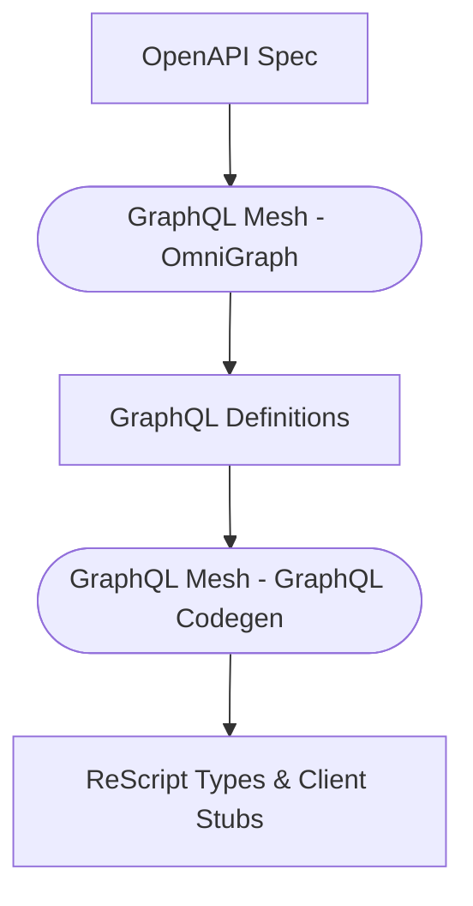

# rescript-codegen

ReScript code generator and toolkit for GraphQL/OpenAPI integration, powered by [GraphQL Code Generator](https://the-guild.dev/graphql/codegen) & [GraphQL Mesh](https://the-guild.dev/graphql/mesh)

## Not only GraphQL!

It can handle OpenAPI (or Swagger) for sure!

Generated runtime will be ran on the [graphql-js](https://github.com/graphql/graphql-js), it's not that different compared to other typical client runtime implementations.

## LICENSE

[MIT](LICENSE)
